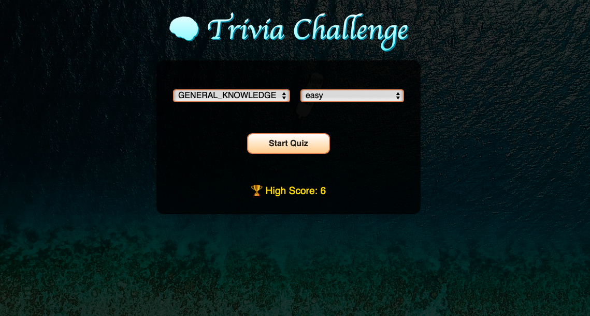

# 🧠 Trivia Challenge

A dynamic quiz application built with React, Vite and TypeScript that tests your knowledge across various categories and difficulty levels. Features timed questions, sound feedback, and progress tracking.




## 🚀 Features

- **Multiple Question Categories**: Choose from 12+ categories including Science, History, Sports, and more
- **Adjustable Difficulty**: Select from Easy, Medium, or Hard difficulty levels
- **Time Management**:
  - 15-second timer per question
  - +5s bonus for correct answers
  - -5s penalty for wrong answers
- **Immersive Experience**:
  - Sound effects for correct/wrong answers and timeouts
  - Progress bar showing quiz completion
  - Instant answer feedback
- **High Score Tracking**: Persistent local storage of best scores
- **Post-Game Review**: Detailed breakdown of answers after completing the quiz
- **Error Handling**: Clear error messages for API issues

## 📦 Installation

1. Clone the repository:
   ```bash
   git clone https://github.com/edogola4/quiz-app.git

2. Install dependencies:
   ````bash
    yarn install / npm install
3. Start the development server:
   ```bash
   npm start / yarn run dev


## 🎮 Usage
 **1. Setup Screen:**
   - Select your preferred category from the dropdown
   - Choose difficulty level (Easy/Medium/Hard)
   - Click "Start Quiz"

**2.Gameplay:**
- Read each question carefully
- Select your answer before time runs out
- Earn bonus time for correct answers
- Track your score and progress in real-time

**3.Post-Game:**
- View final score and high score
- Review all questions with correct/incorrect indicators
- Option to play again with new settings


## 🔧 Technologies

- *React 18*
- *TypeScript*
- *Styled Components*
- *Open Trivia Database API*
- *HTML5 Audio for sound effects*
- *Vite*

## 🌟 Features in Detail

**1.Categories**

Choose from diverse categories including:

- General Knowledge
- Science & Nature
- Computers
- Mathematics
- History
- Sports
- Art
- Geography
- And more!


**2.Difficulty Modes**

- **Easy:** Straightforward questions
- **Medium:** Moderately challenging
- **Hard:** Expert-level questions


**3.Time Mechanics**

- Base time: 15 seconds/question
- Correct answer: +5 seconds (max 30s)
- Wrong answer: -5 seconds (min 5s)


**4.Score System**

- 1 point per correct answer
- High score persistence using localStorage

## 📂 Project Structure
- /src
- ├── API.ts              - # API configuration and types
- ├── App.tsx             - # Main application component
- ├── App.styles.ts       - # Global styles
- ├── Components
- │   └── QuestionCard    - # Question display component
- ├── assets
- │   └── sounds         - # Sound effects


## 🙋 FAQ

**Q: Where are the questions from?**
- A: Questions are sourced from the Open Trivia Database.

**Q: Can I add more categories?**
- A: Yes! Modify the Category enum in API.ts to add more categories supported by the API.

**Q: How are scores persisted?**
- A: High scores are saved in the browser's local storage.

**Q: Why am I seeing an error message?**
- A: Errors typically occur due to API connectivity issues. Check your internet connection and try again.

## 📝 License

This project is licensed under the MIT License - see the LICENSE file for details.


## 🙌 Credits

- Open Trivia Database for question data
- Sound effects from freesound.org
- React community for awesome tools and libraries
- Myself for coding it

  ## Contributing

If you want to contribute to this project, feel free to fork the repository, make your changes, and submit a pull request. Contributions are always welcome!

                       Enjoy the quiz, and may the best trivia master win! 🧠
